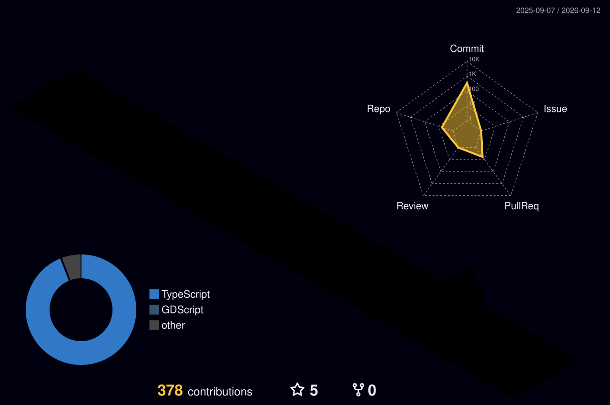

<h1 align="center">Olá, eu sou Bernardo Santos 👋</h1>
<h3 align="center">Full Stack Developer • Mobile Specialist • Cybersecurity Enthusiast</h3>

  <em>"Transformando café em código limpo e escalável."</em>

  Estudante de <b>Análise e Desenvolvimento de Sistemas</b>. Sou apaixonado por criar arquiteturas robustas, seja no mobile com Flutter ou na web moderna com React. Atualmente focado em performance, UX refinada e segurança ofensiva.

---

  
  ### 🚀 Tech Stack & Ferramentas

  #### 📱 Mobile Development
  
  
  
  
  
   

  #### 💻 Frontend Web Moderno
  
  
  
  
  
  
   

  #### ☁️ Backend & Data
  
  
  
  
  

   

  #### 🛠️ Tools & Security
  
  
  
  

---

### 🏆 Projetos em Destaque

<table>
  <tr>
    <td width="50%" valign="top">
      <h3 align="center">🍎 Desperdício Zero (Mobile)</h3>
       
      
Aplicativo complexo focado em sustentabilidade e gestão de alimentos. Construído com arquitetura <b>Offline-First</b>.

       
      <ul>
        <li><b>IA & OCR:</b> Integração com <code>Google ML Kit</code> para ler embalagens e cadastrar produtos via câmera.</li>
        <li><b>Gamificação:</b> Sistema de XP e conquistas gerenciado via <code>Riverpod</code>.</li>
        <li><b>Sync:</b> Sincronização em tempo real com <b>Supabase</b> e cache local via <b>SQLite</b>.</li>
        <li><b>UX:</b> Design System inspirado no WhatsApp com suporte a Dark Mode.</li>
      </ul>
       
      

        
      

    </td>
    <td width="50%" valign="top">
      <h3 align="center">🎮 Tech Gamer Store (Web)</h3>
       
      
E-commerce completo com foco em performance e experiência do usuário, utilizando a stack mais moderna do React.

       
      <ul>
        <li><b>Pagamentos:</b> Checkout real integrado com SDK do <b>Mercado Pago</b>.</li>
        <li><b>Performance:</b> Uso de <code>TanStack Query</code> para cache avançado e otimização de requests.</li>
        <li><b>Design System:</b> Componentes documentados e testados isoladamente no <b>Storybook</b>.</li>
        <li><b>i18n:</b> Suporte nativo a múltiplos idiomas (Inglês/Português).</li>
      </ul>
       
      

        
      

    </td>
  </tr>
</table>

---

  ### 📊 Estatísticas
  
  

    
    
  

  
  

    
  

---

### 📫 Contato & Social

  
  

 

### 🧠 Atualmente estudando
- 🔐 **Segurança Ofensiva** (Pentest & CTFs)
- 📊 **Power BI** para análise de dados avançada

---

  

